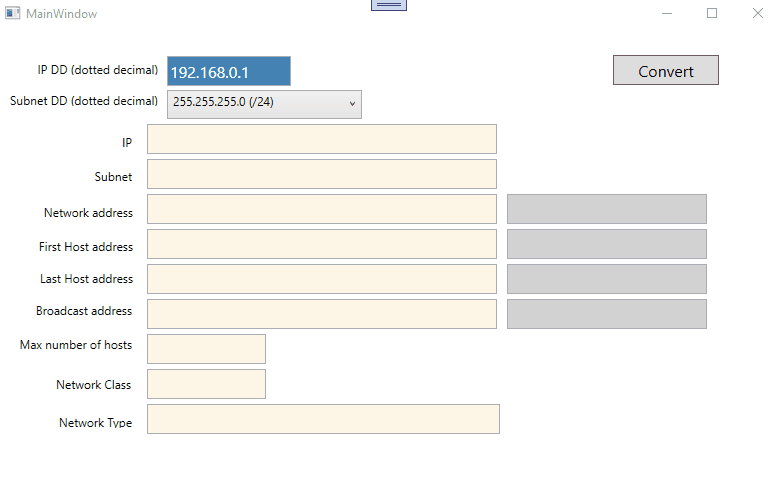
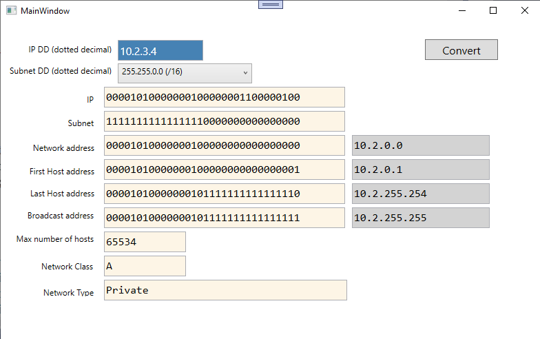

# PE1 IP Calculator
# DEADLINE : zo 24/10/2021

## Demo

 

## Toelichting

Wanneer je de starterscode hebt binnengehaald merk je dat in het WPF project alle XAML code reeds aanwezig is, alsook de (weinige) event-handlers die nodig zijn.

Deze opdracht omvat alles wat we in hoofdstuk 3 (IPv4) behandeld hebben.  
Hoe je één en ander gaat oplossen is uiteraard je vrije keuze : er bestaan heel veel manieren om dit te doen.  
Wat we wel van jou verwachten is :  
  * je gebruikt GEEN kant en klare oplossingen die je op het internet kunt vinden.  Je codeert alles zelf.
  * maak een CLASS LIBRARY aan en plaats zoveel mogelijk logica in entiteitsklassen en/of serviceklassen.  
  * je kunt uiteraard met je medestudenten overleggen, maar je maakt je oplossing zelfstandig.  Plagiaat wordt uiteraard bestraft met een nul score voor alle partijen.

## Tip

Je kant best beginnen met eerst een service klasse aan te maken met daarin (al dan niet statische) methoden die een aantal elementaire bewerkingen doen.  
Bijvoorbeeld : 
  * zet een Byte om in een BitArray
  * zet een Byte en/of BitArray om in een String van 8 karakters, waarbij elk karakter een voorstelling is van 1 bit 
  * zet een dotted decimal notatie (bv 192.168.0.1) om in een String van 32 karakters, waarbij elk karakter een voorstelling is van 1 bit
  * ...  
Waarschijnlijk zal je niet meteen alle methoden die je zal nodig hebben voorzien, maar begin met de meest voor de hand liggende, en vul achteraf aan volgens nodig blijkt.

Voorzie eveneens een entiteitsklasse en een service klasse voor de subnetmaskers, waarmee je onder meer de combobox cbmSubnet gaat bevolken. Voorzie uiteraard alle mogelijke subnetmaskers (van CIDR /0 tot en met  CIDR /30).

In je code behind (WPF) roep je enkel bovenvermelde methoden op en vul je alle controls zoals in de demo opgegeven.
Je dient enkel te controleren of de gebruiker een geldig IP nummer heeft ingevoerd.

 

